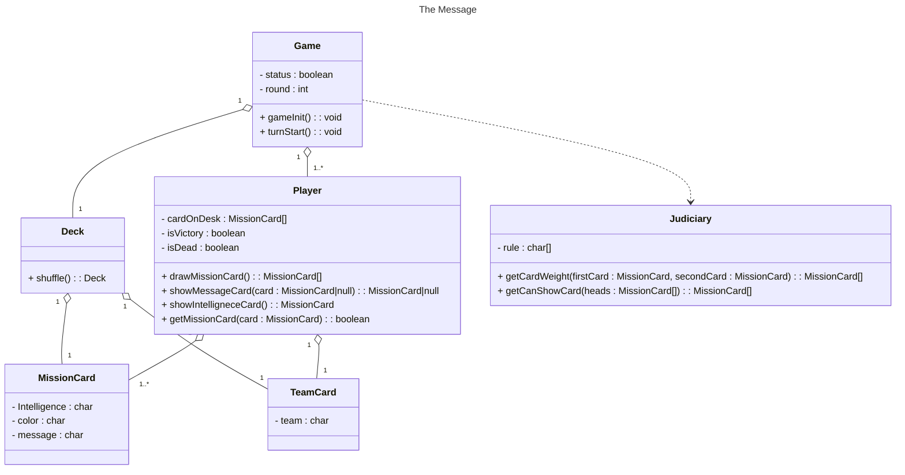

# The-Message
風聲-黑名單

## Step to Run in Backend

1. 進入 Backend 資料夾
```bash
cd Backend
```

2. docker 建置出 MySQL 環境
```bash
docker-compose up -d
```

3. 進行 DB 資料表清空與重新建置
```bash
go run ./cmd/migrate/fresh.go
```

4. 進行 DB Migration
```bash
go run ./cmd/migrate/migrate.go
```

5. 開啟 Go Web Server
```bash
go run cmd/app/main.go
```

6. 進行第一個 Request 呼叫

 - 有兩種方式可以進行 Request 呼叫，如以下所示：

   1. 將 `The-Message.postman_collection.json` 檔匯入至 Postman 中，並執行 Collection 當中的 API。

   2. 撰寫一個 HTTP Method 為 POST 的 Request，路徑為 `localhost:8080/api/v1/games`，並帶入以下玩家 JSON 資料。
  ```json
  {
      "players": [{
        "id": "6497f6f226b40d440b9a90cc",
        "name": "A"
    }, {
        "id": "6498112b26b40d440b9a90ce",
        "name": "B"
    }, {
        "id": "6499df157fed0c21a4fd0425",
        "name": "C"
    }]
  }
  ```

## Class Diagram

