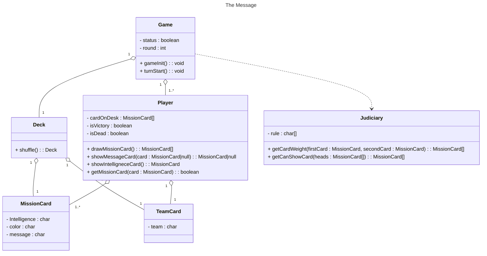

# The-Message
風聲-黑名單

## Step to Run in Backend

- 進入 Backend 資料夾
```bash
  cd Backend
```

- docker 建置出 MySQL 環境
```bash
  docker-compose up -d
```

- 進行 DB 資料表rollback
```bash
  go run ./cmd/migrate/rollback.go
```

- 進行 DB Migration
```bash
  go run ./cmd/migrate/migrate.go
```

- 進行 DB 資料表清空與重新建置
```bash
  go run ./cmd/migrate/refresh.go
```

- 進行 DB Seeder
```bash
  go run  ./cmd/migrate/game_card_seeder.go
```

- 自動產生 Swagger API 文件
```bash
  swag init -g ./cmd/app/main.go -output ./cmd/app/docs
```

- 開啟 Go Web Server
```bash
  go run cmd/app/main.go
```

- 進行第一個 Request 呼叫

 - 有兩種方式可以進行 Request 呼叫，如以下所示：

   - 將 `The-Message.postman_collection.json` 檔匯入至 Postman 中，並執行 Collection 當中的 API。

   - 撰寫一個 HTTP Method 為 POST 的 Request，路徑為 `localhost:8080/api/v1/games`，並帶入以下玩家 JSON 資料。
  ```json
  {
      "players": [{
        "id": "6497f6f226b40d440b9a90cc",
        "name": "A"
    }, {
        "id": "6498112b26b40d440b9a90ce",
        "name": "B"
    }, {
        "id": "6499df157fed0c21a4fd0425",
        "name": "C"
    }]
  }
  ```

查看 API 文件網址：
```
http://127.0.0.1:8080/swagger/index.html
```

## Class Diagram



## Usage 

### Development

#### Add missing and remove unused modules
```bash
  go mod tidy
```

### Goimports

#### Install

```bash
  go get golang.org/x/tools/cmd/goimports
```

#### Run

```bash
  goimports -l -w . 
```

### GoLangCI-Lint

#### Install

```bash
  go get github.com/golangci/golangci-lint/cmd/golangci-lint
```

#### Run

```bash
  golangci-lint run ./...
```
