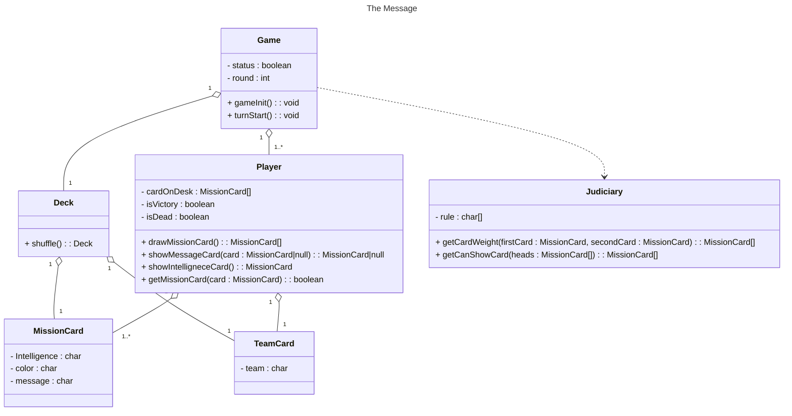

# The-Message
風聲-黑名單

## Class Diagram

```mermaid
---
title: The Message
---

classDiagram
    Game "1" o-- "1..*" Player
    Game "1" o-- "1" Deck
    Deck "1" o-- "1" TeamCard
    Deck "1" o-- "1" MissionCard
    Player "1" o-- "1..*" MissionCard
    Player "1" o-- "1" TeamCard
    Game ..> Judiciary
    class Game{
      - status : boolean
      - round : int
      + gameInit() : void
      + turnStart() : void
    }
    class Player{
      - cardOnDesk : MissionCard[]
      - isVictory : boolean
      - isDead : boolean
      + drawMissionCard() : MissionCard[]
      + showMessageCard(card : MissionCard|null) : MissionCard|null
      + showIntelligneceCard() : MissionCard
      + getMissionCard(card : MissionCard) : boolean
    }
    class Deck{
      + shuffle() : Deck
    }
    class TeamCard{
      - team : char
    }
    class MissionCard{
      - Intelligence : char
      - color : char
      - message : char
    }
    class Judiciary{
      - rule : char[]
      + getCardWeight(firstCard : MissionCard, secondCard : MissionCard) : MissionCard[]
      + getCanShowCard(heads : MissionCard[]) : MissionCard[]
    }
```